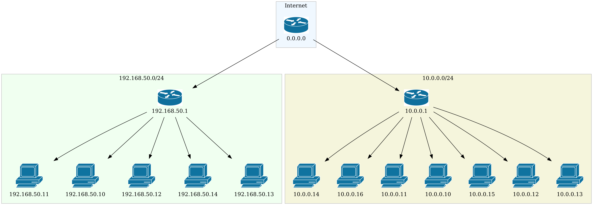

# Network Topology Visualizer
This program creates a network topology based on scan report files fed by *OpenVAS* or *nmap*.  
It can use either *CSV OpenVAS scan files* or *XML nmap -sn scan files*  

## User Guide Manual  
1. Install Python and venv `sudo apt install python3 python3-venv python3-pip -y`
2. Git clone this repository `git clone https://github.com/GeorgePene/topology-generator.git`
3. Move into the repository's cloned directory `cd topology-generator` 
4. Create a virtual environment 
   1. `python3 -m venv venv`
   2. `source venv/bin/activate`
5. Install Required Python Packages
   1. `sudo apt install graphviz graphviz-dev pkg-config -y`
   2. `pip install matplotlib networkx pygraphviz python-dotenv`
6. In the *.env* file, specify the absolute path of the directory in which *CSV* or *XML* scan report files are located
7. Run the program `python topology.py`
8. Exit virtual environment `deactivate`
